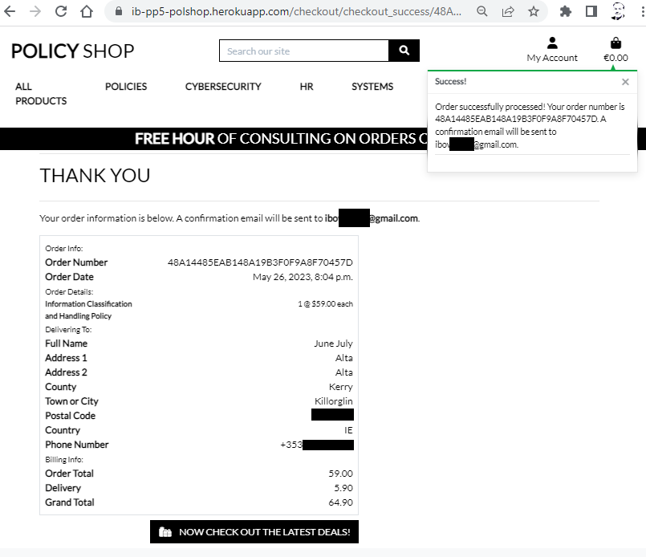

Welcome  

This is my Code Institute student PP5 final project PolicyShop readme for the project deployed to [https://ib-pp5-polshop.herokuapp.com/](https://ib-pp5-polshop.herokuapp.com/)

Note: To open any links in this README in a new browser tab, press CTRL + Click or right click and open in new tab/window.

The Policy Shop is an online store where clients can purchase a wide range of cybersecurity policies and expertise. 
Stripe is used as the payment processor. 
Use the test card number 4242 4242 4242 4242 with a future expiration date, a three-digit CVC, and a five-digit postal code to test the payment functionality.

# PolicyShop

### By [Ian Bowell](https://www.instagram.com/skianianiam/)

## **[Live site](https://ib-pp5-polshop.herokuapp.com/)**

---

## Table of Contents
* [Features](#features)
* [Future Enhancements](#future-enhancements)
* [Technologies Used](#technologies-used)
* [Agile Development](#agile-development)
* [Testing](#testing)
* [User Experience Design (UX)](#ux)
* [Deployment](#deployment)
* [Release History](#release-history)
* [Credits](#credits)
* [Reminders](#reminders)


## Introduction

* [Back to table of contents](#table-of-contents) 
* [Back to top of README.md](#policyshop) 

PolicyShop is a website built in Django using Python, JavaScript, CSS and HTML. 


[View the live website on Heroku](https://ib-pp5-polshop.herokuapp.com/)

Note: To open any links in this README in a new browser tab, press CTRL + Click.

> Responsive Examples of Live Site


 - The site is fully responsive across multiple screen sizes and devices. 

### **[Link to Responsive Testing Examples on UI.dev](https://ui.dev/amiresponsive?url=https://ib-pp5-polshop.herokuapp.com/)**

### Site Goals
- Site owner aim
    - Site owner can effectively sell their policies and services.
    - Site owner add or update their available policies and services.
    - Site owner can highlight their policies and services in sale or featured products category.
-  Site User Goals:
    - Can easily find the policies and services.
    - Have a great user experience.
    - Can purchase policies and services easily.

### Web Marketing
The use of social media marketing is very important for bringing in customers and increasing visibility of the site. 
The approved way to generate interest is an organic approach as the marketing budget will be small initially.

Facebook marketing is often more important than any other platform, we are using it for this project. 
An image of the Facebook site can be found [here](docs/screenshot/others/FB_page_1.png) and [here](docs/screenshot/others/FB_page_2.png).

### Search Engine Optimization
The meta keywords and description in base.html have been amended to the researched keywords. 
On significant pages like the index and product pages, the site title has the name The Policy Shop and also has keywords.

The homepage has also been designed with SEO in mind. 
Some of the keywords are also used in the text portions of the webpage, with strong tags surrounding the major keywords, to improve search results. 

For SEO purposes, we have also added a sitemap.xml and robots.txt file to the website's root directory for search engines to crawl the site. 

A sitemap is a method of classifying a website, indicating the URLs and the information contained within each section.
The URLs on your website that a search engine crawler is permitted to visit are specified in a robots.txt file.


## Features

* [Back to table of contents](#table-of-contents) 
* [Back to top of README.md](#policyshop) 
### Existing Features

### Navigation
- The navigation bar on all pages, allows users to access the key pages.
- The navbar uses a hamburger menu toggle on smaller displays and is fully responsive.
- The user can see whether they are logged in from the "My Account" dropdown options, which vary depending on the user role (admin etc). This dropdown has additional choices only available to admin users.
- only logged in users can access the profile or logout pages.
- only logged out users can access login and register page.
- The menu collapses to a toggler on smaller screens, leaving the account, search and basket and burger menu links in the navbar allowing for easy navigation across all device sizes.
- Navigation on large screen
    

- Navigation on smaller screen
    

### Footer
- Links to the site's social media pages are provided in the footer and the footer is available on all pages of the website.
- The footer also provides navigation to other important parts of the site including the Contact, FAQ page and Privacy.


### Home Page
The home page is divided into different sections.

- A hero image with a link to the All Products page and some text content to boost SEO (Search Engine Optimisation).


- The Featured Products section displays the most recently added eight featured products. 
- Only the admin has access to select which products will be added as featured products.


- The Recently Added Products section displays the most recently added eight products. 


- The comments section displays bootstrap carosel reviews. 
- It shows the product image, who reviewed it and the review details.


### Products Page
- The All Products page displays all the products available on the website. 
- The user has the option to sort the products by various categories. 
- Once the user clicks on the product, they go to the product details page.
- A sale tag is added automatically if product is on sale along with the original price

- Edit, Delete options are displayed on this page when the superuser/admin is logged in.


### Search Page
- The search page searches for the products and displays on the page.
- It also displays the total number of matches that were found in the search results

    

### Product Details Page

- The product detail page provides additional information about the products
- The user can choose the quantity of the product they wish to purchase
- A comment form is displayed in the review section for registered users to leave a comment.
- Review of the product is displayed if there is a review available on that product.

    

### Ordersheet Page

- The Ordersheet page provides a summary of the items in the ordersheet and total prices.
- The page calculates prices of items automatically if an item is on sale.
- The user may easily make their final purchasing decisions because they have the opportunity to update or remove goods from the ordersheet.

    

### Checkout Page
- The checkout page is intended to make it easy for a user to make purchase.
- Only registered users can save their info for future purchase.
- It also shows the summary of the products so that the user knows what they are purchasing before making the payment.
- The page gives the buyer an option to create an account if they wish to save their details for future.

    

### Checkout Success Page
- Once the order has been processed, a checkout success page is loaded to let the customer know whether or not their purchase was successful.
- An email of the order confirmation is also sent to the user.

    


### Profile Page
- A registered user can easily access their order history and modify their default shipping information on their profile page.
- User can also update their information.
    


### Privacy Page
- The Privacy page displays the site privacy policy so that the user can easily understand their privacy in relation to the site.
- Store owners can edit, update and delete the privacy policy via the site admin page.
    

### FAQS Page
- The FAQ page displays FAQs so that the user can easily find an answer.
- Through the FAQ page, the store owner can quickly add a question and the relevant answer, and it will be immediately available for site visitors.
- Store owners can edit, update and delete a FAQ.
    

### Contact Page
- The Contact page displays the imaginary address of the company office and its location on the map.
- It also gives users the option to send a quick message about their queries.
- The admin can view the message in the admin panel. 
- The admin does not have option to reply back to the message but that can be added in the future feature

    

### Error 404 Page

- A 404 error page gives the user a helpful message if a link is used incorrectly.
- It also gives the user a way to get back to the home page with a link.

    

### Forgot Password
- If a user forgets their password they can reset it. 
- They will be asked to enter their email, and the site will send them an email with a link to reset their password.
- User will be asked to enter their password twice for confirmation.

- password reset form
    

- email received to reset password
    

## Future Enhancements

* [Back to table of contents](#table-of-contents) 
* [Back to top of README.md](#policyshop) 

Future Enhancements here

## Technologies Used

* [Back to table of contents](#table-of-contents) 
* [Back to top of README.md](#policyshop) 

## Language Used
- [HTML5](https://en.wikipedia.org/wiki/HTML5)
- [CSS3](https://en.wikipedia.org/wiki/CSS)
- [JavaScript](https://en.wikipedia.org/wiki/JavaScript)
- [Python](https://en.wikipedia.org/wiki/Python_(programming_language))

## Frameworks Used
- [Django](https://www.djangoproject.com/) - A high-level Python web framework for rapid development with clean, pragmatic design.

- [Bootstrap](https://getbootstrap.com/) - A framework for building responsive, mobile-first sites.

# Libraries Used
- [Django Allauth](https://django-allauth.readthedocs.io/en/latest/index.html) - is used for user authentication, registration & account management to the site.
- [Django Crispy Forms](https://django-crispy-forms.readthedocs.io/en/latest/) - is used to add bootstrap styling to the forms used.
- [Django Countries](https://pypi.org/project/django-countries/) - is used for the country CountryField in the checkout page.
- [jQuery](https://jquery.com/) - is used for styling components and also in some of the custom JS used throughout the site.
- [Google Fonts](https://fonts.google.com/) - is used for websites font
- [Font Awesome](https://fontawesome.com/) - is used for all the icons on the site.
- [Image Compressor](https://imagecompressor.com/) - is used to compress images
- [Mailchimp](https://mailchimp.com/) - is used to create the newsletter signup form.
- [Facebook Pages](https://www.facebook.com/)
- [Stripe](https://stripe.com/gb) - is used for the processing of payments.
- [Heroku](https://dashboard.heroku.com/apps) - is used to deploy the site.
- [Gunicorn](https://gunicorn.org/) - is used as the server to run Django on Heroku.
- [Amazon AWS](https://aws.amazon.com/) - is used store the static and media files for the site.
- [PostgresSQL](https://www.postgresql.org/) - is used as the database for the site.
- [Git](https://git-scm.com/) - is used as version control 
- [Github](https://github.com/) - is used to store the project's code.
- [pillow](https://pypi.org/project/Pillow/) - Python imaging library
- [psycopg2](https://pypi.org/project/psycopg2/) - database adapter which allow us to connect with a postgres database
- [boto3](https://pypi.org/project/boto3/) - Allows connection to AWS S3 bucket


## Database Used

[ElephantSQL](https://www.elephantsql.com/) for deployment to heroku.

## Stripe
[Stripe](https://stripe.com/gb) has been used for the payment for this website.

The developer mode in Stripe allows us to use and process test payments.

Type | card No | Expiry | CVC | ZIP
--- | --- | --- | --- | ---
Success | **4242 4242 4242 4242** | A date in the future | Any 3 digits| Any 3 digits
Require authorisation | **4000 0027 6000 3184** | A date in the future | Any 3 digits| Any 5 digits

## Agile Development

* [Back to table of contents](#table-of-contents) 
* [Back to top of README.md](#policyshop) 

Agile here

## Testing
* [Back to table of contents](#table-of-contents) 
* [Back to top of README.md](#policyshop) 

Testing was divided into different sections to ensure everything was tested individually with test cases developed for each area.

Details of the [testing](/docs/testing/TESTING.md) procedures and methodology can be found in the testing.md file [here](/docs/testing/TESTING.md)

The site was also tested for responsiveness here https://www.browserstack.com/responsive and here https://ui.dev/amiresponsive


> Responsive Examples of Live Site


 - The site is fully responsive across multiple screen sizes and devices. 

 I had to carry out significant security research, updates and testing to get this test to work.
 Most people simply removed x-frame checks with a Chrome addin. 
 I did not think this a full solution so I implemented the following line in base.html

 `<meta http-equiv="Content-Security-Policy"...` , listing the sites that
 are allowed to embed my site in theirs, with success above. 
 This is a more informative and professionally production ready approach.
 - HOWEVER, the drawback is that the more advanced functionality of exernal maps, bootstrap and Stripe all need to be included.
 - So I reverted to removing the x-frame checks at this time.


### Bugs of note

It is difficult to enforce input validation to image file types. 
Enforcing the file types within the cloudinary documentation was not found. 
This enabled users to upload non-image file types. 
To address this issue, within the view that handles the form submission, I may try a try, except statement that attempts to upload the file. 
If the upload fails due to the file type error on the cloudinary servers, it handles the error and provides the user with an error message informing them what happened and why. 
This prevents users from breaking the functionality of the site, whilst still enabling them to correct the file they are trying to upload.

### Development bugs: 

#### fixed 

1) During early testing, I ran into an AWS error with credentials where a new line was accidentally added to the end of the AWS codes.
   The issue is described and resolved here - https://github.com/boto/botocore/issues/2001

2) During later testing of the checkout process, emails were not being sent, due to the render_to_string failing to find the templates.
   A similar issue is described here - https://stackoverflow.com/questions/67066334/django-cant-find-my-template-directory-even-though-its-configured-in-settings
   In the end, I resolved it by removing the path element from the template filename, and adding the directory to templates listed in settings.py
   I put in place lots of console logging which I have since removed, but it was nice to see the flow of checkout in the logs.


## UX

* [Back to table of contents](#table-of-contents) 
* [Back to top of README.md](#policyshop) 

UX here

## Deployment

* [Back to table of contents](#table-of-contents) 
* [Back to top of README.md](#policyshop) 

Deployment here


## Release History
* [Back to table of contents](#table-of-contents) 
* [Back to top of README.md](#policyshop) 

We continually tweak and adjust this.

Here is the version history:

**20 April 2023:** Begin MVP planning.

**04 May 2023:** Successful initial heroku deployment.

**20 May 2023:** Successful initial post deletion logic. Needs more checks and post editing/adding.

**10 June 2023:** Successful deployment of submission features.

**17 June 2023:** Final deployment of submission features, following further documentation and testing.

------


## Credits
* [Back to table of contents](#table-of-contents) 
* [Back to top of README.md](#policyshop) 


-   ### Source code

    - Code Institute Django course material, tutors, mentors and colleagues in Slack channels.
    - Bootstrap documentation https://getbootstrap.com/docs/5.3/getting-started/introduction/ 
    
-   ### Images
    - Product images https://www.pexels.com/ 
    - favicon.ico generation https://favicon.io/favicon-generator/
    - Colors from [Lilybug Design](https://www.lilybugdesign.co.nz/procreate-color-palettes)


## Reminders
* [Back to table of contents](#table-of-contents) 
* [Back to top of README.md](#policyshop) 

To install django, `pip3 install 'django<4' gunicorn`

This also installs the gunicorn. Gunicorn (‘Green Unicorn’) is a pure-Python WSGI server for UNIX. It has no dependencies and can be installed using pip.
https://docs.djangoproject.com/en/4.1/howto/deployment/wsgi/gunicorn/

A Web Server Gateway Interface (WSGI) server implements the web server side of the WSGI interface for running Python web applications.
https://www.fullstackpython.com/wsgi-servers.html 

You may also want to install the following packages for the database and storage in Cloudinary or AWS.
Psycopg is the most popular PostgreSQL database adapter for the Python programming language.
and `pip3 install dj_database_url==0.5.0 psycopg2`
and `pip3 install dj3-cloudinary-storage` or the AWS equivalent that we use here for static data

Once all is installed, you can record the installed packages to requirements.txt 
with `pip3 freeze > requirements.txt`

and reload them with `pip3 install -r requirements.txt` 

### Initiating the Django project files
To create the essential manage.py file and the key step in enabling the site to launch
use `django-admin startproject "put your appname here" .` DON'T forget the DOT at the end !!

Here we use `polshop`
Don't forget the DOT at the end as this tells Django admin that we want to create our project in the current top level folder.

Then use `python3 manage.py startapp basket` for example, to create the order basket app within the project

And we update `settings.py` with details for the apps, hosts and secrets etc.
Remove the default SECRET_KEY secret entry in settings.py and use the env.py load method detailed below.

You will also need to load the SECRET_KEY in settings.py from env.py with `SECRET_KEY = os.environ.get('SECRET_KEY')`

Use `python3 manage.py runserver` to launch web server once the environment variables are all set up

```
python3 manage.py runserver
```

We add the app with `python3 manage.py startapp polshop` for example

Then we need to migrate the changes to the database etc with `python3 manage.py migrate`

Remember to update settings.py with all the env vars for secure access to Django and the Elephant DB in the database section

```
import os
import dj_database_url
from django.contrib.messages import constants as messages
if os.path.isfile('env.py'):
    import env
```

To set up a app/database admin we need `python3 manage.py createsuperuser`


### add an admin user
To set up a app/database admin we need `python3 manage.py createsuperuser`

in settings.py add EMAIL_BACKEND = 'django.core.mail.backends.console.EmailBackend'

add ACCOUNT_ and LOGIN_ settings too.

use `cp -r ../.pip-modules/lib/python3.8/site-packages/allauth/templates/* templates/allauth` to copy the baseline allauth html etc to allow modification with prioritised files

The base.html for the site can be obtained from https://getbootstrap.com/
and the version for this from https://getbootstrap.com/docs/4.6/getting-started/introduction/ with changes to replace the slim version with the full popper version.

once this is setup then we can set up a home page app with 
`manage.py startapp home`

Then we can create and edit index.html in `home/templates/home` and extend base.html 

### add a favicon

To add a favicon.ico to /static, add `<link rel="shortcut icon" type="image/png" href=""/>` to base.html and `STATICFILES_DIRS = [os.path.join(BASE_DIR, 'static'),]` to settings.py

Do the same for media dirs etc.

### enable fontawesome icon use
add `<link rel="stylesheet" href="https://cdnjs.cloudflare.com/ajax/libs/font-awesome/5.15.3/css/all.min.css">` to base.html to get icons for menu buttons etc.

### load categories fixtures into database
```
python3 manage.py loaddata categories
# should say - Installed 9 object(s) from 1 fixture(s) 
# Don't forget to install requirements.txt via `pip3 install -r requirements.txt`
# and don't forget (if it's a new database) to 'python3 manage.py makemigrations' 
# and 'python3 manage.py migrate' to get the extra fields for category etc.
```

### load products fixtures into database
```
python3 manage.py loaddata products
# should say - Installed 172 object(s) from 1 fixture(s)
```

don't forget custom_storeages.py for AWS S3 support.

To install the app in Heroku you need:

1) Environment variables from env.py in your Heroku app settings
2) A Procfile to run the webserver i.e. `web: gunicorn policyshop.wsgi` 
    
    in this case to run my policyshop app on the gunicorn wsgi webserver.

Remember also to `python manage.py collectstatic`

The project can now be deployed to Heroku at the website configured above.

To log into the Heroku toolbelt CLI:

1. Log in to your Heroku account and go to *Account Settings* in the menu under your avatar.
2. Scroll down to the *API Key* and click *Reveal*
3. Copy the key
4. In Gitpod, from the terminal, run `heroku_config`
5. Paste in your API key when asked

You can now use the `heroku` CLI program - try running `heroku apps` to confirm it works. This API key is unique and private to you so do not share it. If you accidentally make it public then you can create a new one with _Regenerate API Key_.

and to address a common pylint warning, update `.gitpod.yml` with
```
    - ms-toolsai.vscode-jupyter-cell-tags
    - ms-toolsai.vscode-jupyter-slideshow
```

**Anything more?**

Yes! We'd strongly encourage you to look at the source code!

---

Happy coding!
* [Back to table of contents](#table-of-contents) 
* [Back to top of README.md](#policyshop) 
