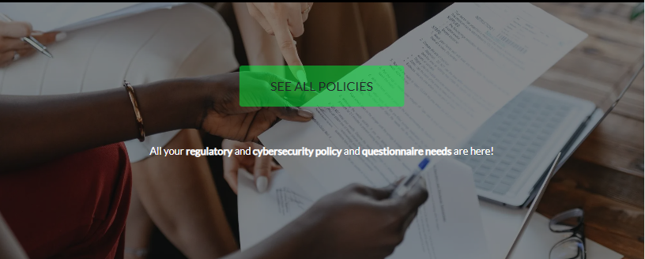
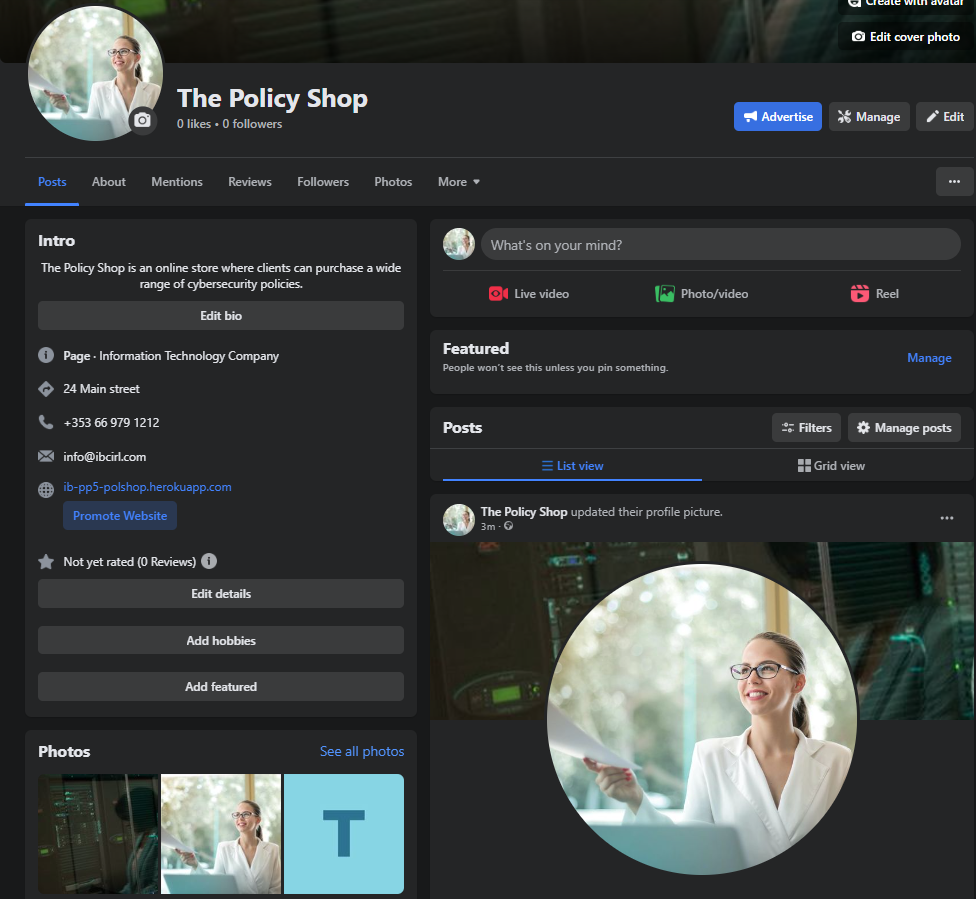

# PolicyShop

Welcome !

This is my Code Institute student PP5 final project PolicyShop readme for the project deployed to [https://ib-pp5-polshop.herokuapp.com/](https://ib-pp5-polshop.herokuapp.com/)

Note: To open any links in this README in a new browser tab, press CTRL + Click or right click and open in new tab/window.

The Policy Shop is an online store where clients can purchase a wide range of cybersecurity policies and expertise. 
Stripe is used as the payment processor. 
Use the test card number 4242 4242 4242 4242 with a future expiration date, a three-digit CVC, and a five-digit postal code to test the payment functionality.

### By [Ian Bowell](https://www.instagram.com/skianianiam/)

## **[Live site](https://ib-pp5-polshop.herokuapp.com/)**

---

## Introduction

* [Back to table of contents](#table-of-contents) 
* [Back to top of README.md](#policyshop) 

PolicyShop is a website built in Django using Python, JavaScript, CSS and HTML. 

[View the live website on Heroku](https://ib-pp5-polshop.herokuapp.com/)

Note: To open any links in this README in a new browser tab, press CTRL + Click.

> Responsive Examples of Live Site

 - The site is fully responsive across multiple screen sizes and devices. 

### **[Link to Responsive Testing Examples on UI.dev](https://ui.dev/amiresponsive?url=https://ib-pp5-polshop.herokuapp.com/)**

### Site Goals
- Site owner aim
    - Site owner can effectively sell their policies and services.
    - Site owner add or update their available policies and services.
    - Site owner can highlight their policies and services in sale or featured products category.
-  Site User Goals:
    - Can easily find the policies and services.
    - Have a great user experience.
    - Can purchase policies and services easily.

## Table of Contents
* [Features](#features)
     - [Future Enhancements](#future-enhancements)
     - [Web Marketing](#web-marketing)
* [Design/UX](#design)
     - [Wireframes](#wireframes)
     - [Model Schema](#model-schema)
* [Technologies Used](#technologies-used)
* [Agile Development](#agile-development)
* [Testing](#testing)
* [Deployment](#deployment)
* [Release History](#release-history)
* [Credits](#credits)

## Features

* [Back to table of contents](#table-of-contents) 
* [Back to top of README.md](#policyshop) 
### Existing Features

### Navigation
- The navigation bar on all pages, allows users to access the key pages.
- The navbar uses a hamburger menu toggle on smaller displays and is fully responsive.
- The user can see whether they are logged in from the "My Account" dropdown options, which vary depending on the user role (admin etc). This dropdown has additional choices only available to admin users.
- only logged in users can access the profile or logout pages.
- only logged out users can access login and register page.
- The menu collapses to a toggler on smaller screens, leaving the account, search and ordersheet and burger menu links in the navbar allowing for easy navigation across all device sizes.

- Navigation on large screen

    

- Navigation on smaller screen
 
    

### Footer
- Links to the site's social media pages are provided in the footer and the footer is available on all pages of the website.
- The footer also provides navigation to other important parts of the site including the Contact, FAQ page and Privacy.

### Home Page
The home page is divided into different sections.

- A hero image with a link to the All Products page and some text content to boost SEO (Search Engine Optimisation).

- The Featured Products section displays the most recently added eight featured products. 
- Only the admin has access to select which products will be added as featured products.

- The Recently Added Products section displays the most recently added eight products. 

- The comments section displays bootstrap carousel reviews. 

    It shows the product image, who reviewed it and the review details.

    Lots of work here to get the carousel to look good in BS4.

    BS5 carousel looks better but BS5 breaks tables and uses different code for toast close icons

    Had to remove the border and align the buttons to the top of the carousel.

    Still don't like the faded buttons till you hover.

* [Back to table of contents](#table-of-contents) 
* [Back to top of README.md](#policyshop) 

### Products Page
- The All Products page displays all the products available on the website. 
- The user has the option to sort the products by various categories. 
- Once the user clicks on the product, they go to the product details page.
- A sale tag is added automatically if product is on sale along with the original price

- Edit, Delete options are displayed on this page when the superuser/admin is logged in.

### Search Page
- The search page searches for the products and displays on the page.
- It also displays the total number of matches that were found in the search results

    

### Product Details Page

- The product detail page provides additional information about the products
- The user can choose the quantity of the product they wish to purchase
- A comment form is displayed in the review section for registered users to leave a comment.
- Review of the product is displayed if there is a review available on that product.

    

### Ordersheet Page

- The Ordersheet page provides a summary of the items in the ordersheet and total prices.
- The page calculates prices of items automatically if an item is on sale.
- The user may easily make their final purchasing decisions because they have the opportunity to update or remove goods from the ordersheet.

    

### Checkout Page
- The checkout page is intended to make it easy for a user to make purchase.
- Only registered users can save their info for future purchase.
- It also shows the summary of the products so that the user knows what they are purchasing before making the payment.
- The page gives the buyer an option to create an account if they wish to save their details for future.

    

### Checkout Success Page
- Once the order has been processed, a checkout success page is loaded to let the customer know whether or not their purchase was successful.
- An email of the order confirmation is also sent to the user.

    

* [Back to table of contents](#table-of-contents) 
* [Back to top of README.md](#policyshop) 

### Profile Page
- A registered user can easily access their order history and modify their default shipping information on their profile page.
- User can also update their information.
    

### Privacy Page
- The Privacy page displays the site privacy policy so that the user can easily understand their privacy in relation to the site.
- Store owners can edit, update and delete the privacy policy via the site admin page.
    

### FAQ Page
- The FAQ page displays FAQs so that the user can easily find an answer.
- Through the FAQ page, the store owner can quickly add a question and the relevant answer, and it will be immediately available for site visitors.
- Store owners can edit, update and delete a FAQ.
    

### Contact Page
- The Contact page displays the imaginary address of the company office and its location on the map.
- It also gives users the option to send a quick message about their queries.
- The admin can view the message in the admin panel. 
- The admin does not have option to reply back to the message but that can be added in the future feature

    

### Error 404 Page

- A 404 error page gives the user a helpful message if a link is used incorrectly.
- It also gives the user a way to get back to the home page with a link.

    

### Forgot Password
- If a user forgets their password they can reset it. 
- They will be asked to enter their email, and the site will send them an email with a link to reset their password.
- User will be asked to enter their password twice for confirmation.

- password reset form
    

- password reset confirmed form
    

- email received to reset password
    

- page to reset password
    

## Future Enhancements

* [Back to table of contents](#table-of-contents) 
* [Back to top of README.md](#policyshop) 

Future Enhancements user stories [here](https://github.com/ian-IBCIRL/IB-PP5-MVP/milestone/2)

### Other future features
- Could add product consulting availability hours and displays next date work can be started and completed.
- Could add an order tracking page with ordersheet linked to multiple delivery options to allow clients to monitor order delivery and scheduling.
- Could add a 'Favourite' button where clients can save services to their favourites for later use. 
- Could enable Site admin to respond to a message on the site
- Could enable Site admin to respond to and/or delete a comment on the site
- The example app used sizes for products i.e. XS, S, M, L, XL. I don't use product sizes for consulting services and time, but am considering changing to hours, days, weeks etc in a future version.

### Web Marketing
The use of social media marketing is very important for bringing in customers and increasing visibility of the site. 
The approved way to generate interest is an organic approach as the marketing budget will be small initially.

Facebook marketing is often more important than any other platform, we are using it for this project. 

I started with the CI planning template [below](./docs/screenshot/others/FB_page_1.png), 

and created a page which may still be visible [here](https://www.facebook.com/profile.php?id=100093005050282)

#### Images of the Facebook site can be seen as follows:

- Screenshot of Facebook page CI planning template

- Screenshot of Facebook page live

- Screenshot of Facebook page mobile

- Screenshot of Facebook page desktop

### Search Engine Optimization
The meta keywords and description in base.html have been amended to the researched keywords. 
On significant pages like the index and product pages, the site title has the name The Policy Shop and also has keywords.

The homepage has also been designed with SEO in mind. 
Some of the keywords are also used in the text portions of the webpage, with strong tags surrounding the major keywords, to improve search results. 

For SEO purposes, we have also added a sitemap.xml and robots.txt file to the website's root directory for search engines to crawl the site. 

A sitemap is a method of classifying a website, indicating the URLs and the information contained within each section.
The URLs on your website that a search engine crawler is permitted to visit are specified in a robots.txt file.

## Design
The website is created to look good and be easy to use, and also making it possible for a customer to browse and buy products and services of interest quickly and easily.
Wireframes for desktop, tablet, and mobile views were produced and only few colors were used to maintain the ARIA accessibility of the website.

- ## Wireframes
wireframes for the project were created using [Balsamiq](https://balsamiq.com/)

* [Back to table of contents](#table-of-contents) 
* [Back to top of README.md](#policyshop) 

- Home Page 

    

- Product Page

    Product page displays all the products available in the store.

- Product Details Page

    Displays the details of the product. Users can add products to their ordersheet. 
    They can also +/- the amount of products and update the bag from here.
    

- Register Page

    Users can register on this page. 
    If they are already registered, the page gives them a link to the Login page.
    

- Login

    Users can log in on this page. 
    If they are not registered, there is a link to the register page.
    
    

* [Back to table of contents](#table-of-contents) 
* [Back to top of README.md](#policyshop) 

- Ordersheet

    Users can add items to their ordersheet. 
    This page gives them options to increment or decrement their products as well as to remove them.
    
    

- Checkout Page

    Users can enter their shipping and card details to make a purchase. 
    The user must create an account to save their details for future use.
    
    

- Checkout Success Page

    Once the checkout is complete, the user is redirected to checkout success page, where they can see their order details and shipping details.
    
    

- Contact Page

    Users can view company details and they can fill up the form contact us.
    
    

- Faqs Page

    Users can find frequently asked questions.
    
    

* [Back to table of contents](#table-of-contents) 
* [Back to top of README.md](#policyshop) 

- ## Color Schema

The color palette for this project was kept as simple as possible in order to maintain the contrast between the background and the foreground.

- ## Model Schema

Two relational databases were used to create the site. 
The builtin Django SQLite database was used for development and then Elephant SQL Postgres for the deployed version. 

* [Back to table of contents](#table-of-contents) 
* [Back to top of README.md](#policyshop) 

I found https://dbschema.com/download.html  did a super job of documenting my database ERD etc. 

Bit messy getting the elephant SQL url in the right format to log in, but easy enough

The site is based around a number of models separated into the following main groups.

**Product Models**

**Category** - stores the details of a product category.

- **Product** - stores all the details about a product for sale. Connected to the featured product, recently added products and Category objects via foreign key relationships.

- **Review / Comments** - stores a user review of a product and is connected to the Product and by foreign key relationships.

* [Back to table of contents](#table-of-contents) 
* [Back to top of README.md](#policyshop) 

**User Models**

- **User** - the Django Allauth user model containing information such as username and password.
- **Profile** - stores a users default delivery information and is connected to the User via a one to one relationship.

**Order Models**
- **Order** - a foreign key relationship connects the user profile to the storage of the complete order data.
- **OrderLineItem** - stores the product information for a single product purchased on an order. Foreign key relationships connect the product and order.

Three additional models providing general information for the site user or store owner have also been used.

- **Contact** - stores a site user message submitted through the contact form.
- **Privacy** - provides the site privacy policy.
- **FAQ** - stores FAQ questions and answers that the site owner has added to the site.

    

## Agile Development

* [Back to table of contents](#table-of-contents) 
* [Back to top of README.md](#policyshop) 

To see the list of [issues](https://github.com/ian-IBCIRL/IB-PP5-MVP/issues?q=is%3Aissue+sort%3Acreated-asc) click [here](https://github.com/ian-IBCIRL/IB-PP5-MVP/issues?q=is%3Aissue+sort%3Acreated-asc)

This project was started with my GitHub Projects [Page](https://github.com/users/ian-IBCIRL/projects/5) to track and manage the [issues](https://github.com/ian-IBCIRL/IB-PP5-MVP/issues?q=is%3Aissue+sort%3Acreated-asc) such as expected epics, user stories, milestones and other work and sprints involved.
The purpose of Agile Development is to plan and measure progress for expected work and tasks, by listing the epics and then break them down into user stories or smaller tasks to ultimately finish the site in the allocated time.

To see my Kanban board in the project, click [here](https://github.com/users/ian-IBCIRL/projects/5).
To see the list of [issues](https://github.com/ian-IBCIRL/IB-PP5-MVP/issues?q=is%3Aissue+sort%3Acreated-asc) click [here](https://github.com/ian-IBCIRL/IB-PP5-MVP/issues?q=is%3Aissue+sort%3Acreated-asc)

At the initial stages I decided on core requirements ('must have' issues) for the project and some 'could have' issues but not critical requirements.

From these I added the associated Epics, user stories, acceptance criteria and the tasks so I can track my work effectively.
I did also use [milestones](https://github.com/ian-IBCIRL/IB-PP5-MVP/milestones?direction=desc&sort=completeness&state=open) as another way to visualise Epic completion status.

Once I completed a task I note the item as completed and if all parts of this story were completed I would move it from **In Progress** to **Done** on the Kanban board. Acceptance criteria would also be noted where appropriate.

At the end of a coding session I would update the user stories with a comment of:

 - What was done
 - What is left to be done
 - Reminders to track where I finished so subsequent work would follow.

* [Back to table of contents](#table-of-contents) 
* [Back to top of README.md](#policyshop) 

#### Epics

##### Completed Epics

1. [EPIC: Initial Project Setup](https://github.com/ian-IBCIRL/IB-PP5-MVP/issues/1)
2. [EPIC: The Home Page](https://github.com/ian-IBCIRL/IB-PP5-MVP/issues/3)
3. [EPIC: Setup Services and Products](https://github.com/ian-IBCIRL/IB-PP5-MVP/issues/6)
4. [EPIC: Order Processing](https://github.com/ian-IBCIRL/IB-PP5-MVP/issues/11)
5. [EPIC: User profiles](https://github.com/ian-IBCIRL/IB-PP5-MVP/issues/18)
6. [EPIC: Site and Product Admin](https://github.com/ian-IBCIRL/IB-PP5-MVP/issues/26)
7. [EPIC: Additional Features](https://github.com/ian-IBCIRL/IB-PP5-MVP/issues/31)
8. [EPIC: SEO and Web Marketing](https://github.com/ian-IBCIRL/IB-PP5-MVP/issues/36)
9. [EPIC: Testing](https://github.com/ian-IBCIRL/IB-PP5-MVP/issues/40)
10. [EPIC: User CRUD for orders (and profiles)](https://github.com/ian-IBCIRL/IB-PP5-MVP/issues/42)

#### User stories

#####  Completed User Stories

To view details of the user stories please click on a user story below.
See the project page for the full [list of issues](https://github.com/ian-IBCIRL/IB-PP5-MVP/issues?q=is%3Aissue) to see the details and comments.
See the Kanban page [here](https://github.com/users/ian-IBCIRL/projects/4/views/1)

* [Back to table of contents](#table-of-contents) 
* [Back to top of README.md](#policyshop) 

 1. [USER STORY: Setup Authentication](https://github.com/ian-IBCIRL/IB-PP5-MVP/issues/2)
 2. [USER STORY: Setup Base Page](https://github.com/ian-IBCIRL/IB-PP5-MVP/issues/4)
 3. [USER STORY: Setup Home Page (index.html)](https://github.com/ian-IBCIRL/IB-PP5-MVP/issues/5)
 4. [USER STORY: Product and services setup](https://github.com/ian-IBCIRL/IB-PP5-MVP/issues/7)
 5. [USER STORY: Product Filtering](https://github.com/ian-IBCIRL/IB-PP5-MVP/issues/8)
 6. [USER STORY: Product Searching](https://github.com/ian-IBCIRL/IB-PP5-MVP/issues/9)
 7. [USER STORY: Product Sorting](https://github.com/ian-IBCIRL/IB-PP5-MVP/issues/10)
 8. [USER STORY: Order Processing Setup](https://github.com/ian-IBCIRL/IB-PP5-MVP/issues/12)
 9. [USER STORY: Adding Products](https://github.com/ian-IBCIRL/IB-PP5-MVP/issues/13)
 10. [USER STORY: Adjusting and Deleting Products](https://github.com/ian-IBCIRL/IB-PP5-MVP/issues/14)
 11. [USER STORY: Checkout](https://github.com/ian-IBCIRL/IB-PP5-MVP/issues/15)
 12. [USER STORY: Purchasing with Stripe](https://github.com/ian-IBCIRL/IB-PP5-MVP/issues/16)
 13. [USER STORY: NOtifications, Messages, Toasts](https://github.com/ian-IBCIRL/IB-PP5-MVP/issues/17)
 14. [USER STORY: Setup User profiles](https://github.com/ian-IBCIRL/IB-PP5-MVP/issues/19)
 15. [USER STORY: Adding Users with Profiles](https://github.com/ian-IBCIRL/IB-PP5-MVP/issues/20)
 16. [USER STORY: Adjust allauth default pages](https://github.com/ian-IBCIRL/IB-PP5-MVP/issues/21)
 17. [USER STORY: Adjusting user profile and default delivery info](https://github.com/ian-IBCIRL/IB-PP5-MVP/issues/22)
 18. [USER STORY: Adding Order History to User Profile](https://github.com/ian-IBCIRL/IB-PP5-MVP/issues/23)
 19. [USER STORY: Stripe Webhooks to catch delays/errors](https://github.com/ian-IBCIRL/IB-PP5-MVP/issues/24)
 20. [USER STORY: Notifications from Profile info](https://github.com/ian-IBCIRL/IB-PP5-MVP/issues/25)
 21. [USER STORY: Adding Products to catalog as Admin](https://github.com/ian-IBCIRL/IB-PP5-MVP/issues/27)
 22. [USER STORY: Editing Products as Admin](https://github.com/ian-IBCIRL/IB-PP5-MVP/issues/28)
 23. [USER STORY: Deleting Products as Admin](https://github.com/ian-IBCIRL/IB-PP5-MVP/issues/29)
 24. [USER STORY: Adjusting admin+allauth forms format](https://github.com/ian-IBCIRL/IB-PP5-MVP/issues/30)
 25. [USER STORY: Adjust models for new PP5 data/features](https://github.com/ian-IBCIRL/IB-PP5-MVP/issues/32)
 26. [USER STORY: FAQ app/model](https://github.com/ian-IBCIRL/IB-PP5-MVP/issues/33)
 27. [USER STORY: Contact app/model](https://github.com/ian-IBCIRL/IB-PP5-MVP/issues/34)
 28. [USER STORY: Privacy app/model](https://github.com/ian-IBCIRL/IB-PP5-MVP/issues/35)
 29. [USER STORY: SEO Features](https://github.com/ian-IBCIRL/IB-PP5-MVP/issues/37)
 30. [USER STORY: Web marketing and FB](https://github.com/ian-IBCIRL/IB-PP5-MVP/issues/38)
 31. [USER STORY: e-commerce business model](https://github.com/ian-IBCIRL/IB-PP5-MVP/issues/39)
 32. [USER STORY: Testing](https://github.com/ian-IBCIRL/IB-PP5-MVP/issues/41)
 33. [USER STORY: account registration](https://github.com/ian-IBCIRL/IB-PP5-MVP/issues/43)
 34. [USER STORY: Create order for me only](https://github.com/ian-IBCIRL/IB-PP5-MVP/issues/44)
 35. [USER STORY: Update order for me only](https://github.com/ian-IBCIRL/IB-PP5-MVP/issues/45)
 36. [USER STORY: Delete my orders only](https://github.com/ian-IBCIRL/IB-PP5-MVP/issues/46)
 37. [USER STORY: Setup CSS](https://github.com/ian-IBCIRL/IB-PP5-MVP/issues/47)
 38. [USER STORY: Site Menu](https://github.com/ian-IBCIRL/IB-PP5-MVP/issues/50)

The following User stories were not completed as they are possible future features:

 ##### Future Feature User stories

 39. [USER STORY: Consulting Service Bookings](https://github.com/ian-IBCIRL/IB-PP5-MVP/issues/48)
 40. [USER STORY: Social Media Login](https://github.com/ian-IBCIRL/IB-PP5-MVP/issues/49)

I decided against implementing some future features at this time due to deadlines and because the core requirements of the project have been satisfied elsewhere.

## Testing
* [Back to table of contents](#table-of-contents) 
* [Back to top of README.md](#policyshop) 

Testing is in different sections and individually tested with test cases developed for each function.

I managed to get [automated](https://github.com/ian-IBCIRL/IB-PP5-MVP/blob/main/docs/testing/TESTING.md#automated-testing) testing to work [here](https://github.com/ian-IBCIRL/IB-PP5-MVP/blob/main/docs/testing/TESTING.md#automated-testing) initially for Profiles and FAQs models, and then further model coverage.

I got automated testing to work for most of the models, with up to 76% coverage overall, according to the coverage [report](/report.txt)

I will continue to develop [automated](https://github.com/ian-IBCIRL/IB-PP5-MVP/blob/main/docs/testing/TESTING.md#automated-testing) testing and continue to check coverage.
I also found this YouTube series helpful for the testing [section](https://www.youtube.com/watch?v=3R62qpDhQfI&list=PLx-q4INfd95ESFMQ1Je3Z0gFdQLhrEuY7&index=31) and will work to add more test refactoring and other features in later forks, after the assessor review.

Details of the [testing](/docs/testing/TESTING.md) procedures and methodology can be found in the testing.md file [here](/docs/testing/TESTING.md)

The site was also tested for responsiveness here https://www.browserstack.com/responsive and here https://ui.dev/amiresponsive

> Responsive Examples of Live Site

 - The site is fully responsive across multiple screen sizes and devices. 

 I had to carry out significant security research, updates and testing to get this test to work.
 Most people simply removed x-frame checks with a Chrome addin. 
 I did not think this a full solution so I implemented the following line in base.html

 `<meta http-equiv="Content-Security-Policy"...` , listing the sites that
 are allowed to embed my site in theirs, with success above. 
 This is a more informative and professionally production ready approach.
 - HOWEVER, the drawback is that the more advanced functionality of exernal maps, bootstrap and Stripe all need to be included.
 - So I reverted to removing the x-frame checks at this time.

### Bugs of note

It is difficult to enforce input validation to image file types. 
Enforcing the file types within the cloudinary documentation was not found. 
This enabled users to upload non-image file types. 
To address this issue, within the view that handles the form submission, I may try a try, except statement that attempts to upload the file. 
If the upload fails due to the file type error on the cloudinary servers, it handles the error and provides the user with an error message informing them what happened and why. 
This prevents users from breaking the functionality of the site, whilst still enabling them to correct the file they are trying to upload.

### Development bugs: 

#### fixed 

1) During early testing, I ran into an AWS error with credentials where a new line was accidentally added to the end of the AWS codes.
   The issue is described and resolved here - https://github.com/boto/botocore/issues/2001

2) During later testing of the checkout process, emails were not being sent, due to the render_to_string failing to find the templates.
   A similar issue is described here - https://stackoverflow.com/questions/67066334/django-cant-find-my-template-directory-even-though-its-configured-in-settings
   In the end, I resolved it by removing the path element from the template filename, and adding the directory to templates listed in settings.py
   I put in place lots of console logging which I have since removed, but it was nice to see the flow of checkout in the logs.

3) The comments section displays bootstrap carousel reviews. It shows the product image, who reviewed it and the review details.
    Lots of work here to get the carousel to look good in BS4.
    BS5 carousel looks better but BS5 breaks table row spacing and uses different code for toast close icons and button layout.
    Had to remove the BS4 button border and align the button text spans to the bottom.
    Still don't like the faded buttons till you hover.
    BS5 also breaks table layout for checkout, product editing/creating and profile info.

4) Trying to get performance improvements in Ligthouse for initial page load.
     rel="preload" as="style" made the biggest difference to the performance.

Further details of the [testing](/docs/testing/TESTING.md) procedures and methodology can be found in the testing.md file [here](/docs/testing/TESTING.md)

## Technologies Used

* [Back to table of contents](#table-of-contents) 
* [Back to top of README.md](#policyshop) 

- ## Language Used
- [HTML5](https://en.wikipedia.org/wiki/HTML5)
- [CSS3](https://en.wikipedia.org/wiki/CSS)
- [JavaScript](https://en.wikipedia.org/wiki/JavaScript)
- [Python](https://en.wikipedia.org/wiki/Python_(programming_language))

- ## Frameworks Used
- [Django](https://www.djangoproject.com/) - A high-level Python web framework for rapid development with clean, pragmatic design.

- [Bootstrap](https://getbootstrap.com/) - A framework for building responsive, mobile-first sites.

- # Libraries Used
- [Django Allauth](https://django-allauth.readthedocs.io/en/latest/index.html) - is used for user authentication, registration & account management to the site.
- [Django Crispy Forms](https://django-crispy-forms.readthedocs.io/en/latest/) - is used to add bootstrap styling to the forms used.
- [Django Countries](https://pypi.org/project/django-countries/) - is used for the country CountryField in the checkout page.
- [jQuery](https://jquery.com/) - is used for styling components and also in some of the custom JS used throughout the site.
- [Google Fonts](https://fonts.google.com/) - is used for websites font
- [Font Awesome](https://fontawesome.com/) - is used for all the icons on the site.
- [Image Compressor](https://imagecompressor.com/) - is used to compress images
- [Mailchimp](https://mailchimp.com/) - is used to create the newsletter signup form.
- [Facebook Pages](https://www.facebook.com/)
- [Stripe](https://stripe.com/gb) - is used for the processing of payments.
- [Heroku](https://dashboard.heroku.com/apps) - is used to deploy the site.
- [Gunicorn](https://gunicorn.org/) - is used as the server to run Django on Heroku.
- [Amazon AWS](https://aws.amazon.com/) - is used store the static and media files for the site.
- [PostgresSQL](https://www.postgresql.org/) - is used as the database for the site.
- [Git](https://git-scm.com/) - is used as version control 
- [Github](https://github.com/) - is used to store the project's code.
- [pillow](https://pypi.org/project/Pillow/) - Python imaging library
- [psycopg2](https://pypi.org/project/psycopg2/) - database adapter which allow us to connect with a postgres database
- [boto3](https://pypi.org/project/boto3/) - Allows connection to AWS S3 bucket

- ## Database Used

[ElephantSQL](https://www.elephantsql.com/) for deployment to heroku.

- ## Stripe
[Stripe](https://stripe.com/gb) has been used for the payment for this website.

The developer mode in Stripe allows us to use and process test payments.

Type | card No | Expiry | CVC | ZIP
--- | --- | --- | --- | ---
Success | **4242 4242 4242 4242** | A date in the future | Any 3 digits| Any 3 digits
Require authorisation | **4000 0027 6000 3184** | A date in the future | Any 3 digits| Any 5 digits

## Deployment

* [Back to table of contents](#table-of-contents) 
* [Back to top of README.md](#policyshop) 

The site has been deployed to Heroku at [https://ib-pp5-polshop.herokuapp.com/](https://ib-pp5-polshop.herokuapp.com/)

Deployment details are [here](/docs/DEPLOYMENT.md)

## Release History
* [Back to table of contents](#table-of-contents) 
* [Back to top of README.md](#policyshop) 

We continually tweak and adjust this.

Here is the version history:

**20 April 2023:** Begin MVP planning.

**04 May 2023:** Successful initial heroku deployment.

**20 May 2023:** Successful initial order processing logic.

**26 May 2023:** Successful functional deployment. Working on testing and README docs from now on.

**10 June 2023:** Successful deployment of submission features.

**17 June 2023:** Final deployment of submission features, following further documentation and testing.

------

## Credits
* [Back to table of contents](#table-of-contents) 
* [Back to top of README.md](#policyshop) 

-   ### Source code

    - Code Institute Django course material, tutors, mentors and colleagues in Slack channels.
    - Bootstrap documentation https://getbootstrap.com/docs/5.3/getting-started/introduction/ 
    
-   ### Images
    - Product images https://www.pexels.com/ 
    - favicon.ico generation https://favicon.io/favicon-generator/
    - Colors from [Lilybug Design](https://www.lilybugdesign.co.nz/procreate-color-palettes)

* [Back to table of contents](#table-of-contents) 
* [Back to top of README.md](#policyshop) 
